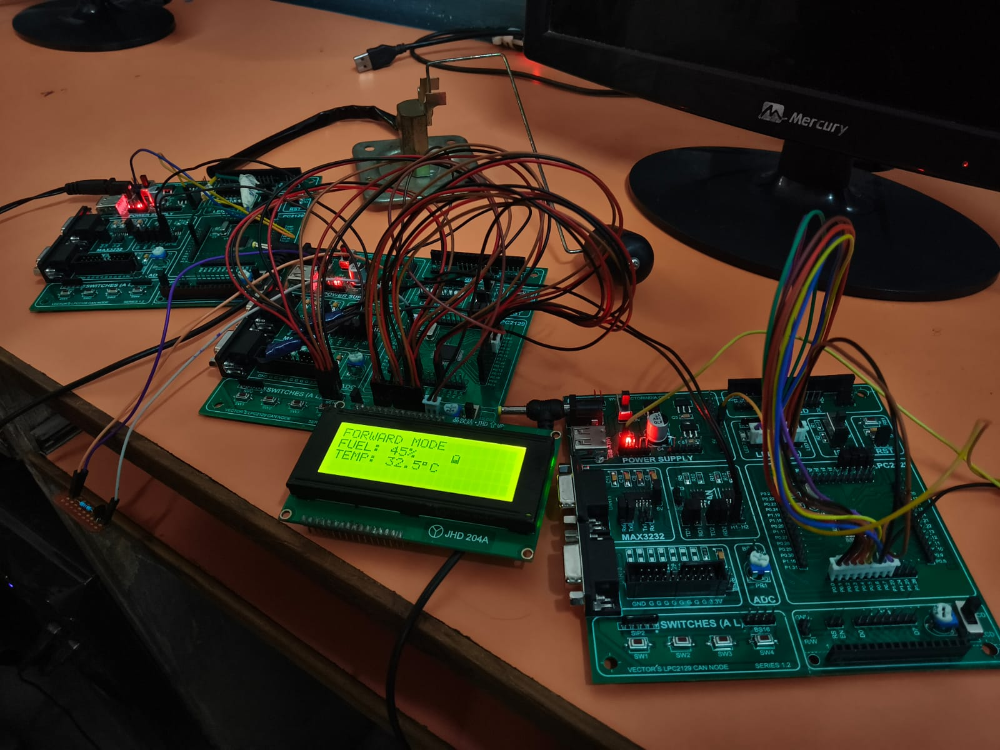
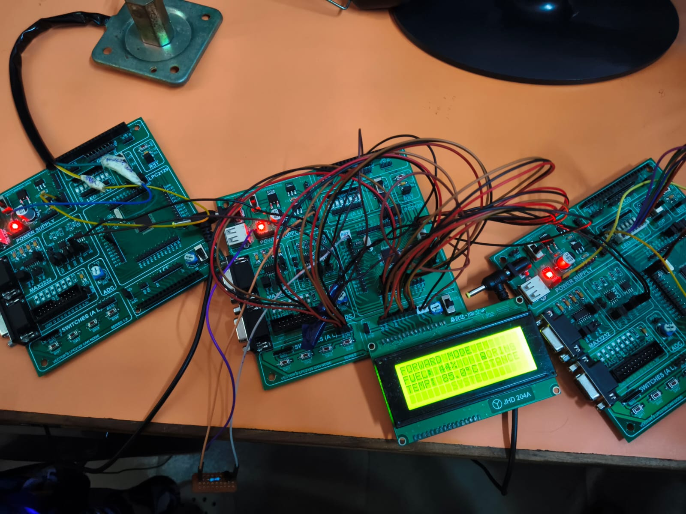
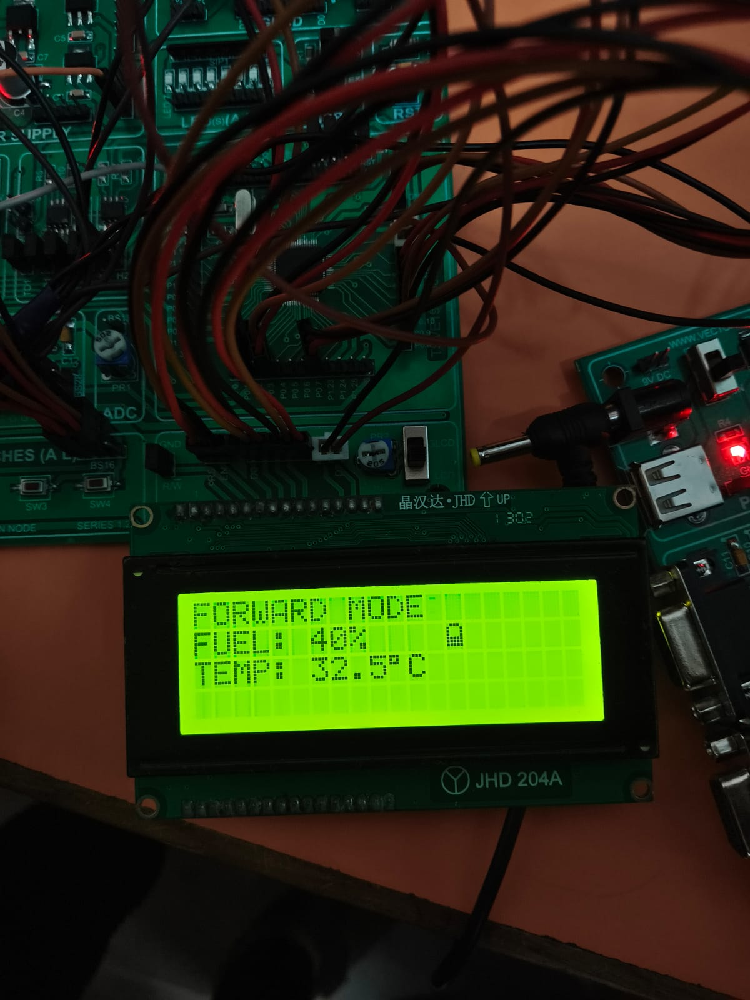
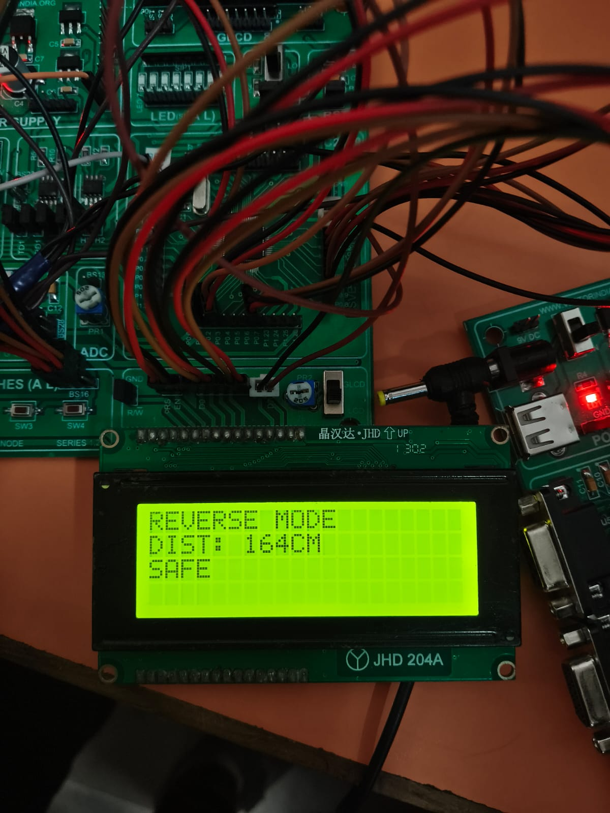

# 🚗 CAN-Driven Vehicle Monitoring & Driver Assistance System

### A Three-Node LPC2129 ARM7-Based Automotive Embedded System Using CAN Communication

[](https://www.nxp.com)
[](https://en.wikipedia.org/wiki/CAN_bus)
[](https://en.wikipedia.org/wiki/C_(programming_language))
[](https://www.keil.com/)
[](https://www.nxp.com/)

------------------------------------------------------------------------

# 1. Overview

The **CAN-Driven Vehicle Monitoring & Driver Assistance System** is a
distributed automotive embedded system developed using multiple
**LPC2129 ARM7TDMI-S microcontrollers** communicating through the
**Controller Area Network (CAN)** protocol.

The system consists of three nodes:

1.  **Main Node**
2.  **Fuel Node**
3.  **Indicator & Reverse Alert Node**

The system monitors engine temperature, fuel information, reverse
obstacle distance, vehicle mode and indicators. The Main Node acts as
the central monitoring and dashboard controller.

### Technologies Demonstrated

-   Embedded C
-   LPC2129 ARM7TDMI-S
-   GPIO
-   ADC
-   External interrupts
-   CAN communication
-   1-Wire communication
-   Ultrasonic distance measurement
-   LCD interfacing
-   LED and buzzer control

------------------------------------------------------------------------

# 2. Project Objectives

-   Develop a distributed automotive embedded system.
-   Implement CAN communication between multiple LPC2129 controllers.
-   Monitor fuel level using ADC.
-   Convert ADC data into fuel percentage.
-   Monitor engine temperature using DS18B20.
-   Detect obstacles during reverse operation.
-   Measure obstacle distance using HC-SR05.
-   Generate SAFE, WARNING and STOP conditions.
-   Control left and right indicators.
-   Display vehicle information on an LCD.
-   Implement external interrupt based switch control.
-   Develop reusable embedded drivers.
-   Integrate multiple peripherals into an automotive application.

------------------------------------------------------------------------

# 3. Complete Feature Table

  -----------------------------------------------------------------------
  Feature                             Description
  ----------------------------------- -----------------------------------
  Distributed CAN Architecture        Three LPC2129 nodes communicate
                                      through CAN

  ARM7 Microcontroller                LPC2129 ARM7TDMI-S

  Fuel Monitoring                     ADC-based analog fuel measurement

  Fuel Percentage                     ADC value converted into percentage

  Temperature Monitoring              DS18B20 temperature measurement

  Reverse Distance Detection          HC-SR05 ultrasonic measurement

  Safety Classification               SAFE / WARNING / STOP

  Buzzer Alert                        Audible reverse warning

  Left Indicator                      CAN-controlled indicator

  Right Indicator                     CAN-controlled indicator

  Direction Selection                 Forward / Reverse mode

  LCD Dashboard                       Vehicle information display

  External Interrupts                 Switch/event based control

  CAN Communication                   Inter-node communication

  Modular Firmware                    Separate firmware for each node

  Embedded Drivers                    ADC, CAN, LCD, Delay, DS18B20,
                                      Ultrasonic

  Bare-Metal C                        Direct peripheral/register
                                      programming
  -----------------------------------------------------------------------

------------------------------------------------------------------------

# 4. Driver Assistance & Warning Logic

## Reverse Distance Warning Table

  Distance       Status    Indication
  -------------- --------- ---------------------------
  `> 50 cm`      SAFE      Normal condition
  `21 - 50 cm`   WARNING   Obstacle approaching
  `<= 20 cm`     STOP      Obstacle critically close

``` text
                    REVERSE MODE
                         |
                         v
                Measure Distance
                         |
              +----------+----------+
              |          |          |
            >50 cm     21-50 cm    <=20 cm
              |          |          |
              v          v          v
            SAFE       WARNING      STOP
              |          |          |
              v          v          v
          Normal       Buzzer      Critical
          Display       Alert       Alert
```

------------------------------------------------------------------------

# 5. Vehicle Mode Logic

## Forward Mode

Forward mode handles normal vehicle operation, temperature/fuel
monitoring and indicator commands.

``` text
                 FORWARD MODE
                      |
          +-----------+-----------+
          |                       |
          v                       v
   Left Indicator          Right Indicator
          |                       |
          v                       v
       CAN ID 3                CAN ID 4
          |                       |
          +-----------+-----------+
                      |
                      v
               Indicator Node
```

## Reverse Mode

``` text
                 REVERSE MODE
                      |
                      v
             Ultrasonic Sensor
                      |
                      v
              Distance Reading
                      |
                      v
                  CAN BUS
                      |
                      v
                  Main Node
                      |
             +--------+--------+
             |        |       |
             v        v       v
           SAFE    WARNING    STOP
```

------------------------------------------------------------------------

# 6. Complete System Architecture

``` text
                         +----------------------+
                         |       CAN BUS        |
                         |      125 kbps        |
                         +----------+-----------+
                                    |
             +----------------------+----------------------+
             |                      |                      |
             v                      v                      v
     +---------------+      +---------------+      +----------------------+
     |   FUEL NODE   |      |   MAIN NODE   |      | INDICATOR & REVERSE  |
     |    LPC2129    |      |    LPC2129    |      |      ALERT NODE      |
     +---------------+      +---------------+      |       LPC2129        |
     | ADC           |      | CAN           |      +----------------------+
     | Fuel Input    |----->| LCD           |<-----| HC-SR05              |
     | CAN           |      | DS18B20       |      | Indicator LEDs       |
     +---------------+      | Interrupts    |      | Buzzer               |
                            +---------------+      | CAN                  |
                                                   +----------------------+
```

  -----------------------------------------------------------------------
  Node                                Main Responsibility
  ----------------------------------- -----------------------------------
  Main Node                           Central monitoring, LCD dashboard,
                                      mode and indicator control

  Fuel Node                           ADC fuel measurement and CAN
                                      transmission

  Indicator & Reverse Alert Node      Indicator control and reverse
                                      obstacle monitoring
  -----------------------------------------------------------------------

------------------------------------------------------------------------

# 7. Main Node

The Main Node is the central monitoring and dashboard controller.

### Responsibilities

-   Receive fuel information through CAN.
-   Monitor engine temperature.
-   Handle Forward / Reverse mode.
-   Detect left indicator input.
-   Detect right indicator input.
-   Send left indicator command.
-   Send right indicator command.
-   Receive reverse information.
-   Display vehicle information on LCD.

``` text
                 +--------------------+
                 |     MAIN NODE      |
                 |      LPC2129       |
                 +---------+----------+
                           |
       +-------------------+-------------------+
       |                   |                   |
       v                   v                   v
    DS18B20               CAN                 LCD
       |                   |                   |
       v                   v                   v
 Temperature        Fuel / Reverse       Vehicle Status
```

------------------------------------------------------------------------

# 8. Fuel Node

The Fuel Node measures the analog fuel input and transmits fuel
information to the Main Node.

### Working

``` text
Analog Fuel Input
       |
       v
      ADC
       |
       v
ADC Conversion
       |
       v
Fuel Calculation
       |
       +-------> CAN ID 1 -------> Main Node
```

------------------------------------------------------------------------

# 9. Indicator & Reverse Alert Node

This node performs indicator control and reverse obstacle monitoring.

### Indicator Functions

-   Receive left indicator command.
-   Receive right indicator command.
-   Control indicator LEDs.

### Reverse Functions

-   Generate HC-SR05 trigger.
-   Measure echo pulse.
-   Calculate distance.
-   Communicate reverse information through CAN.
-   Control warning indication/buzzer.

``` text
          INDICATOR / REVERSE NODE
                     |
          +----------+----------+
          |                     |
          v                     v
   Indicator Control      Reverse Monitoring
          |                     |
          v                     v
   Indicator LEDs           HC-SR05
                                |
                                v
                             Distance
                                |
                                v
                               CAN
```

------------------------------------------------------------------------

# 10. Hardware Components

  Component         Purpose
  ----------------- ---------------------------------
  LPC2129           ARM7 embedded controller
  CAN Transceiver   CAN physical-layer interface
  DS18B20           Temperature sensing
  HC-SR05           Ultrasonic distance measurement
  LCD               Dashboard display
  LEDs              Indicator/status output
  Buzzer            Warning indication
  Switches          Mode and indicator input
  Analog Input      Fuel measurement
  Power Supply      Node power

------------------------------------------------------------------------

# 11. Complete Pin Configuration

## 11.1 Main Node

  LPC2129 Pin   Function     Purpose
  ------------- ------------ ------------------------
  P0.1          EINT0        Forward/Reverse mode
  P0.3          EINT1        Left indicator switch
  P0.7          EINT2        Right indicator switch
  P0.8          LCD D0       LCD data
  P0.9          LCD D1       LCD data
  P0.10         LCD D2       LCD data
  P0.11         LCD D3       LCD data
  P0.12         LCD D4       LCD data
  P0.13         LCD D5       LCD data
  P0.14         LCD D6       LCD data
  P0.15         LCD D7       LCD data
  P0.16         LCD RS       LCD register select
  P0.17         DS18B20 DQ   Temperature data
  P0.18         LCD EN       LCD enable
  LCD RW        GND          LCD write mode
  P0.25         CAN1 RX      CAN receive
  P0.26         CAN1 TX      CAN transmit

## 11.2 Fuel Node

  Interface       Function       Purpose
  --------------- -------------- ---------------------------
  ADC Channel 0   Analog input   Fuel measurement
  CAN1            CAN            Fuel transmission
  LCD             Display        Local information display

> The supplied project material identifies ADC Channel 0 for fuel
> measurement. The exact physical ADC pin should be taken from the
> target-board/source configuration rather than inferred only from the
> channel number.

## 11.3 Indicator & Reverse Alert Node

  LPC2129 Pin   Function       Purpose
  ------------- -------------- --------------------------
  P0.0-P0.7     LED outputs    Indicator/status outputs
  P0.21         HC-SR05 TRIG   Ultrasonic trigger
  P0.22         HC-SR05 ECHO   Ultrasonic echo
  P0.23         Buzzer         Warning output
  P0.25         CAN1 RX        CAN receive
  P0.26         CAN1 TX        CAN transmit

------------------------------------------------------------------------

# 12. CAN Interface Pin Configuration

  LPC2129 Pin   CAN Function   Direction
  ------------- -------------- -----------
  P0.25         CAN1 RX        Receive
  P0.26         CAN1 TX        Transmit

``` text
              LPC2129
                 |
        +--------+--------+
        |                 |
     CAN1 RX           CAN1 TX
      P0.25             P0.26
        |                 |
        +--------+--------+
                 |
                 v
          CAN Transceiver
                 |
          +------+------+
          |             |
        CAN_H         CAN_L
          |             |
          +------+------+
                 |
                 v
               CAN BUS
```

------------------------------------------------------------------------

# 13. CAN Communication Architecture

``` text
                     CAN BUS
                    125 kbps
                        |
        +---------------+---------------+
        |               |               |
        v               v               v
    Fuel Node       Main Node      Reverse Node
        |               |               |
        +---------------+---------------+
```

CAN provides the communication backbone between the distributed
controllers.

------------------------------------------------------------------------

# 14. Complete CAN Message Table

  ------------------------------------------------------------------------------
             CAN ID Sender        Receiver      Message            Purpose
  ----------------- ------------- ------------- ------------------ -------------
                `1` Fuel Node     Main Node     Fuel information   Transmit fuel
                                                                   data

                `2` Indicator &   Main Node     Distance/reverse   Reverse
                    Reverse Alert               information        monitoring
                    Node                                           

                `3` Main Node     Indicator &   Left indicator     Left
                                  Reverse Alert                    indicator
                                  Node                             command

                `4` Main Node     Indicator &   Right indicator    Right
                                  Reverse Alert                    indicator
                                  Node                             command
  ------------------------------------------------------------------------------

``` text
Fuel Node
   |
   | ID 1
   v
Main Node
   |
   +---- ID 3 ----> Indicator/Reverse Node
   |
   +---- ID 4 ----> Indicator/Reverse Node
   ^
   |
   | ID 2
Indicator/Reverse Node
```

------------------------------------------------------------------------

# 15. CAN Frame Information

The CAN application uses a standard CAN data-frame structure.

  Field    Description
  -------- -----------------------------
  CAN ID   Identifies the message
  RTR      Remote Transmission Request
  DLC      Data Length Code
  Data     Application payload

The CAN driver contains frame fields for identifier, RTR, DLC and data.

------------------------------------------------------------------------

# 16. CAN Timing Configuration

  Parameter           Value
  ------------------- ----------------
  CAN Controller      CAN1
  CAN Bit Rate        125 kbps
  Crystal Frequency   12 MHz
  CPU Clock           60 MHz
  Peripheral Clock    15 MHz
  CAN RX              P0.25
  CAN TX              P0.26
  Frame Type          CAN Data Frame

CAN timing is configured through the LPC2129 CAN timing registers.

------------------------------------------------------------------------

# 17. CAN Baud Rate Concept

Target communication rate:

``` text
125 kbps
```

The CAN controller derives the bit timing from the peripheral clock and
CAN timing parameters:

``` text
PCLK
 |
 v
CAN Timing Configuration
 |
 +-- BRP
 +-- TSEG1
 +-- TSEG2
 +-- SJW
 |
 v
125 kbps CAN
```

------------------------------------------------------------------------

# 18. ADC & Fuel Calculation

ADC configuration:

``` text
ADC Resolution = 10 bits
Maximum ADC Value = 1023
Reference Voltage = 3.3 V
```

### Voltage

``` text
Voltage = (ADC Value × 3.3) / 1023
```

### Fuel Percentage

``` text
Fuel Percentage = (Voltage / 3.3) × 100
```

Therefore:

``` text
Fuel Percentage = (ADC Value × 100) / 1023
```

Example:

``` text
ADC = 512

Fuel Percentage ≈ 50%
```

------------------------------------------------------------------------

# 19. Ultrasonic Distance Calculation

The HC-SR05 measurement sequence is:

``` text
LPC2129
   |
   v
Generate Trigger
   |
   v
HC-SR05
   |
   v
Ultrasonic Wave
   |
   v
Obstacle
   |
   v
Echo
   |
   v
Timer Measurement
   |
   v
Distance Calculation
```

The echo pulse duration is measured and converted to distance.

------------------------------------------------------------------------

# 20. DS18B20 Temperature Monitoring

The DS18B20 communicates with the LPC2129 through 1-Wire.

``` text
DS18B20
   |
   | 1-Wire
   v
LPC2129
   |
   v
Temperature Reading
   |
   v
LCD
```

### Sequence

``` text
Initialize
   |
   v
Start Temperature Conversion
   |
   v
Read Sensor Data
   |
   v
Convert Temperature
   |
   v
Display
```

------------------------------------------------------------------------

# 21. Indicator Control

## Left Indicator

``` text
Left Switch
   |
   v
EINT1
   |
   v
Main Node
   |
   v
CAN ID 3
   |
   v
Indicator Node
   |
   v
Left LED
```

## Right Indicator

``` text
Right Switch
   |
   v
EINT2
   |
   v
Main Node
   |
   v
CAN ID 4
   |
   v
Indicator Node
   |
   v
Right LED
```

------------------------------------------------------------------------

# 22. Reverse Warning Operation

``` text
REVERSE MODE
     |
     v
HC-SR05
     |
     v
Distance
     |
     v
CAN ID 2
     |
     v
Main Node
     |
 +---+----------+---+
 |              |   |
 v              v   v
SAFE         WARNING STOP
>50 cm       21-50   <=20 cm
 |              |     |
 v              v     v
Normal       Buzzer  Critical
```

------------------------------------------------------------------------

# 23. LCD Dashboard

### Example Forward Display

``` text
+------------------+
| VEHICLE STATUS   |
| TEMP : XX C      |
| FUEL : XX %      |
| MODE : FORWARD   |
+------------------+
```

### Example Reverse Display

``` text
+------------------+
| VEHICLE STATUS   |
| TEMP : XX C      |
| FUEL : XX %      |
| MODE : REVERSE   |
| DIST : XX CM     |
| STATUS: SAFE     |
+------------------+
```

The exact display strings depend on the application firmware.

------------------------------------------------------------------------

# 24. Complete System Workflow

``` text
                         POWER ON
                            |
                            v
                  Initialize All Nodes
                            |
             +--------------+--------------+
             |              |              |
             v              v              v
         Fuel Node      Main Node      Reverse Node
             |              |              |
             v              v              v
            ADC          LCD/CAN        Ultrasonic
             |              |              |
             v              v              v
       Fuel Information Temperature     Distance
             |              |              |
             +--------------+--------------+
                            |
                            v
                         CAN BUS
                            |
                            v
                       Main Dashboard
                            |
                  +---------+---------+
                  |                   |
                  v                   v
             FORWARD MODE        REVERSE MODE
                  |                   |
                  v                   v
             Indicators          Distance Check
                                      |
                                      v
                              SAFE/WARNING/STOP
```

------------------------------------------------------------------------

# 25. Complete System Data Flow

## Fuel

``` text
Fuel Input -> ADC -> Fuel Node -> CAN ID 1 -> Main Node -> LCD
```

## Reverse

``` text
HC-SR05 -> Reverse Node -> Distance -> CAN ID 2 -> Main Node
```

## Left Indicator

``` text
Left Switch -> EINT1 -> Main Node -> CAN ID 3 -> Reverse/Indicator Node
```

## Right Indicator

``` text
Right Switch -> EINT2 -> Main Node -> CAN ID 4 -> Reverse/Indicator Node
```

------------------------------------------------------------------------

# 26. Software & Development Environment

  Tool / Technology     Purpose
  --------------------- -----------------------------
  Embedded C            Firmware development
  Keil µVision          Compilation and development
  LPC2129               Target MCU
  ARM7TDMI-S            Processor architecture
  Flash Magic           Programming
  CAN                   Inter-node communication
  ADC                   Analog measurement
  GPIO                  Digital I/O
  External Interrupts   Event-driven input
  Timer                 Timing and measurement
  1-Wire                DS18B20
  LCD                   User interface

------------------------------------------------------------------------

# 27. Prerequisites

## Hardware

-   LPC2129 development boards
-   CAN transceivers
-   LCD
-   DS18B20
-   HC-SR05
-   LEDs
-   Buzzer
-   Switches
-   Analog fuel input
-   Power supply

## Software

-   Keil µVision
-   Flash Magic
-   Embedded C environment

## Knowledge

-   C
-   Embedded C
-   ARM7
-   GPIO
-   ADC
-   CAN
-   Interrupts
-   Timers
-   LCD
-   Sensor interfacing

------------------------------------------------------------------------

# 28. Complete Project Repository Structure

``` text
CAN-Driven-Vehicle-Monitoring-System/
|
+-- README.md
|
+-- drivers/
|   +-- ADC.c
|   +-- CAN (1).c
|   +-- Delay (2).c
|   +-- DS18B20.c
|   +-- LCD (1).c
|   +-- ULTRASONIC.c
|
+-- include/
|   +-- ADC (2).h
|   +-- ADC_DEFINES (1).h
|   +-- CAN.h
|   +-- CAN_DEFINES (1).h
|   +-- DEFINES (2).h
|   +-- DELAY (2).h
|   +-- DS18B20.h
|   +-- LCD (2).h
|   +-- LCD_DEFINES (2).h
|   +-- TYPES (1).h
|   +-- ULTRASONIC.h
|
+-- firmware/
|   +-- main-node/
|   |   +-- MAINNODE.c
|   +-- fuel-node/
|   |   +-- FUELNODE.c
|   +-- indicator-reverse-node/
|       +-- Reversenode.c
|
+-- hex/
|   +-- Fuel_Node.hex
|   +-- Indicator_Alert_Node.hex
|   +-- Main_Node.hex
|
+-- images/
|   +-- can-nodes.jpg.jpeg
|   +-- complete-system.jpg.jpeg
|   +-- forward-mode.jpg.jpeg
|   +-- reverse-mode.jpg.jpeg
|
+-- docs/
    +-- CAN_Communication.md
    +-- Hardware.md
    +-- project-specification.pdf
```

------------------------------------------------------------------------

# 29. Embedded Driver Modules

  Driver       Source           Header           Purpose
  ------------ ---------------- ---------------- --------------------
  ADC          `ADC.c`          `ADC (2).h`      Analog measurement
  CAN          `CAN (1).c`      `CAN.h`          CAN communication
  Delay        `Delay (2).c`    `DELAY (2).h`    Timing
  DS18B20      `DS18B20.c`      `DS18B20.h`      Temperature
  LCD          `LCD (1).c`      `LCD (2).h`      LCD interface
  Ultrasonic   `ULTRASONIC.c`   `ULTRASONIC.h`   Distance

------------------------------------------------------------------------

# 30. Driver Responsibilities

## ADC

-   ADC initialization
-   Channel configuration
-   Conversion
-   Result reading

## CAN

-   CAN initialization
-   CAN configuration
-   Transmission
-   Reception
-   Frame handling

Typical application functions:

``` c
Init_CAN1();
CAN1_Tx();
CAN1_Rx();
```

## DS18B20

-   1-Wire initialization
-   Sensor communication
-   Temperature conversion
-   Data reading

## LCD

-   Initialization
-   Command transmission
-   Data transmission
-   String display

## Ultrasonic

-   Trigger generation
-   Echo measurement
-   Timing
-   Distance calculation

## Delay

-   Peripheral timing delays

------------------------------------------------------------------------

# 31. Embedded Concepts Demonstrated

### Microcontroller

-   LPC2129
-   ARM7TDMI-S
-   GPIO
-   Register-level programming

### Communication

-   CAN
-   CAN identifiers
-   CAN transmission
-   CAN reception
-   Multi-node communication

### Sensors

-   ADC
-   DS18B20
-   HC-SR05

### Interrupts

-   External interrupts
-   Interrupt service routines
-   Event-driven control

### Timers

-   Timing
-   Ultrasonic measurement

### Display

-   LCD interfacing
-   Vehicle status display

### Embedded C

-   Functions
-   Structures
-   Pointers
-   Macros
-   Bit manipulation
-   Registers
-   Modular drivers

------------------------------------------------------------------------

# 32. Testing & Validation

## Fuel Node

Verify:

-   ADC initialization
-   ADC reading
-   Fuel calculation
-   CAN transmission

## Main Node

Verify:

-   LCD initialization
-   DS18B20 communication
-   External interrupts
-   CAN reception
-   CAN transmission
-   Forward mode
-   Reverse mode

## Indicator & Reverse Node

Verify:

-   Indicator outputs
-   HC-SR05 trigger
-   Echo measurement
-   Distance calculation
-   Buzzer
-   CAN communication

## Integrated Test

``` text
Fuel Node
   |
   | CAN
   v
Main Node
   |
   +----> LCD
   |
   +----> Indicator CAN command
   |
   v
Reverse Node
   |
   v
HC-SR05
   |
   | CAN
   v
Main Node
```

------------------------------------------------------------------------

# 33. Build Procedure

## Main Node

``` text
firmware/main-node/MAINNODE.c
```

## Fuel Node

``` text
firmware/fuel-node/FUELNODE.c
```

## Indicator & Reverse Node

``` text
firmware/indicator-reverse-node/Reversenode.c
```

### Build Steps

1.  Open the corresponding Keil project.
2.  Select LPC2129 target.
3.  Add required source files from `drivers/`.
4.  Add required headers from `include/`.
5.  Verify target and clock configuration.
6.  Build the target.
7.  Resolve compilation errors.
8.  Enable HEX output.
9.  Rebuild to generate HEX.

------------------------------------------------------------------------

# 34. Flash Procedure

``` text
Compile Firmware
      |
      v
Generate HEX
      |
      v
Connect LPC2129
      |
      v
Open Flash Magic
      |
      v
Select Correct HEX
      |
      v
Program MCU
      |
      v
Reset MCU
      |
      v
Test Node
```

Use the corresponding HEX file for each node.

------------------------------------------------------------------------

# 35. HEX Firmware Files

  HEX File                     Target Node
  ---------------------------- --------------------------------
  `Main_Node.hex`              Main Node
  `Fuel_Node.hex`              Fuel Node
  `Indicator_Alert_Node.hex`   Indicator & Reverse Alert Node

Location:

``` text
hex/
```

------------------------------------------------------------------------

# 36. Project Images

## Complete System



## CAN Nodes



## Forward Mode



## Reverse Mode



------------------------------------------------------------------------

# 37. Project Documentation

## CAN Communication

[CAN Communication Documentation](docs/CAN_Communication.md)

## Hardware

[Hardware Documentation](docs/Hardware.md)

## Project Specification

[Project Specification](docs/project-specification.pdf)

------------------------------------------------------------------------

# 38. Learning Outcomes

This project provides practical experience in:

-   ARM7 microcontroller programming
-   LPC2129 programming
-   Embedded C
-   Bare-metal firmware
-   CAN protocol
-   Multi-node CAN architecture
-   ADC interfacing
-   External interrupts
-   Sensor interfacing
-   LCD interfacing
-   Timer-based measurement
-   1-Wire communication
-   Modular driver development
-   Automotive embedded systems
-   Distributed embedded systems
-   Real-time monitoring
-   Embedded system integration

------------------------------------------------------------------------

# 39. Future Improvements

Possible improvements:

-   CAN error handling
-   CAN bus-off recovery
-   CAN diagnostics
-   CAN data logging
-   Vehicle speed monitoring
-   RPM monitoring
-   Battery voltage monitoring
-   Brake status monitoring
-   Door status monitoring
-   Additional CAN nodes
-   PC-based CAN monitoring
-   CAN-to-USB interface
-   Automotive diagnostics
-   UDS diagnostics
-   Wireless vehicle monitoring
-   Additional driver-assistance functions

------------------------------------------------------------------------

# 40. Project Highlights

### Embedded Systems

-   LPC2129 ARM7TDMI-S
-   Embedded C
-   Bare-metal programming
-   Register-level programming
-   Modular drivers
-   Interrupt-based programming

### Automotive

-   CAN communication
-   Distributed architecture
-   Vehicle monitoring
-   Indicator control
-   Reverse obstacle detection
-   Driver warning

### Sensors

-   DS18B20
-   HC-SR05
-   Analog fuel input

### Interfaces

-   LCD
-   LEDs
-   Buzzer
-   ADC
-   External interrupts

------------------------------------------------------------------------

# 41. Why CAN Was Used

CAN allows multiple embedded controllers to communicate over a shared
automotive communication bus.

## Centralized Architecture

``` text
             Central Controller
              /      |                   /       |                Sensor    Sensor   Actuator
```

## Distributed CAN Architecture

``` text
                 CAN BUS
                    |
       +------------+------------+
       |            |            |
       v            v            v
   Fuel Node    Main Node    Reverse Node
```

The project demonstrates:

-   Shared bus communication
-   Message identification using CAN IDs
-   Distributed node responsibilities
-   Scalable automotive architecture
-   Multi-controller communication

------------------------------------------------------------------------

# 42. Complete Node-to-Node Communication Summary

  From                 To                     CAN ID Information
  -------------------- -------------------- -------- ------------------------------
  Fuel Node            Main Node                   1 Fuel information
  Reverse Alert Node   Main Node                   2 Distance/reverse information
  Main Node            Reverse Alert Node          3 Left indicator command
  Main Node            Reverse Alert Node          4 Right indicator command

``` text
                         CAN BUS
                           |
        +------------------+------------------+
        |                  |                  |
        v                  v                  v
   +---------+        +---------+       +-------------+
   |  FUEL   |        |  MAIN   |       | INDICATOR/  |
   |  NODE   |        |  NODE   |       |   REVERSE   |
   +----+----+        +----+----+       +------+------+
        |                  |                    |
        | ID 1 ----------->|                    |
        |                  |                    |
        |                  |---- ID 3 --------->|
        |                  |---- ID 4 --------->|
        |                  |<---- ID 2 ----------|
        |                  |                    |
```

------------------------------------------------------------------------

# 43. Project Verification Checklist

## Hardware

-   [ ] LPC2129 boards powered correctly
-   [ ] CAN transceivers connected
-   [ ] CAN_H connected
-   [ ] CAN_L connected
-   [ ] Common ground available
-   [ ] LCD connected
-   [ ] DS18B20 connected
-   [ ] HC-SR05 connected
-   [ ] LEDs connected
-   [ ] Buzzer connected
-   [ ] Switches connected
-   [ ] Fuel analog input connected

## Firmware

-   [ ] Main Node firmware programmed
-   [ ] Fuel Node firmware programmed
-   [ ] Indicator Alert Node firmware programmed
-   [ ] CAN configuration verified
-   [ ] Correct node firmware loaded
-   [ ] Required drivers included

## CAN Communication

-   [ ] CAN ID 1 tested
-   [ ] CAN ID 2 tested
-   [ ] CAN ID 3 tested
-   [ ] CAN ID 4 tested
-   [ ] Main Node CAN reception tested
-   [ ] Indicator Node CAN reception tested

## Functional Test

-   [ ] Forward mode tested
-   [ ] Reverse mode tested
-   [ ] Temperature tested
-   [ ] Fuel information tested
-   [ ] Left indicator tested
-   [ ] Right indicator tested
-   [ ] Distance measurement tested
-   [ ] SAFE condition tested
-   [ ] WARNING condition tested
-   [ ] STOP condition tested
-   [ ] Buzzer tested

------------------------------------------------------------------------

# 44. Project Summary, Author & Repository

## Project Summary

The **CAN-Driven Vehicle Monitoring & Driver Assistance System**
demonstrates a practical distributed automotive embedded architecture
using three LPC2129 ARM7-based nodes.

The system integrates:

-   CAN communication
-   ADC
-   GPIO
-   External interrupts
-   Timers
-   DS18B20
-   HC-SR05
-   LCD
-   LEDs
-   Buzzer
-   Embedded C

The architecture separates vehicle functions across multiple controllers
and uses CAN as the communication backbone.

``` text
                 +-----------------------+
                 | VEHICLE MONITORING    |
                 | & DRIVER ASSISTANCE   |
                 +-----------+-----------+
                             |
                      +------+------+
                      |   CAN BUS   |
                      +------+------+
                             |
          +------------------+------------------+
          |                  |                  |
          v                  v                  v
      Fuel Node          Main Node       Indicator/Reverse
          |                  |                  |
          v                  v                  v
         ADC          LCD + Temperature     HC-SR05
          |                  |                  |
          +------------------+------------------+
                             |
                             v
                  Driver Information
                    & Warning System
```

## Author

**Digambar Patil**

### Embedded / Automotive Skills Demonstrated

-   Embedded C
-   ARM7
-   LPC2129
-   CAN Protocol
-   Microcontroller Programming
-   Sensor Interfacing
-   Automotive Embedded Systems
-   Distributed Embedded Architecture

## GitHub Repository

**CAN-Driven Vehicle Monitoring System**

https://github.com/sunnypatil030703-cmd/CAN-Driven-Vehicle-Monitoring-System

## Repository Contents

``` text
✓ README.md
✓ Application firmware
✓ Embedded peripheral drivers
✓ Header files
✓ HEX firmware files
✓ Hardware documentation
✓ CAN communication documentation
✓ Project specification
✓ Project images
✓ Complete project structure
```

------------------------------------------------------------------------

::: {align="center"}
### 🚗 Embedded Systems • ARM7 • LPC2129 • CAN • Automotive Electronics

**Built with Embedded C and LPC2129**
:::
